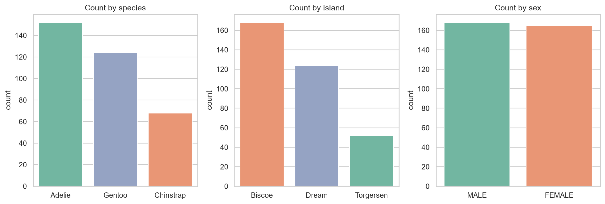
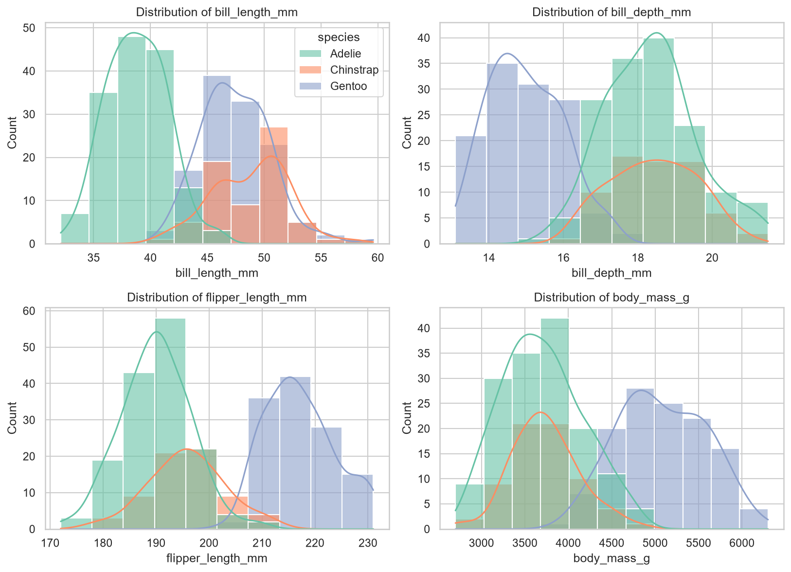
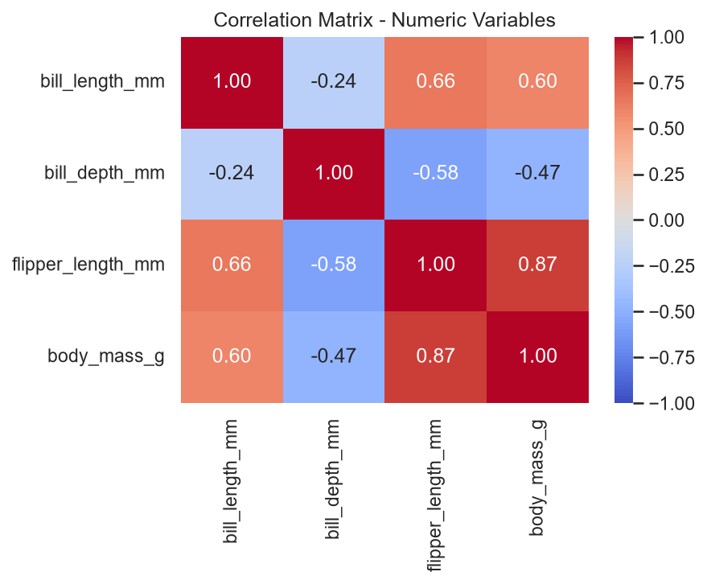
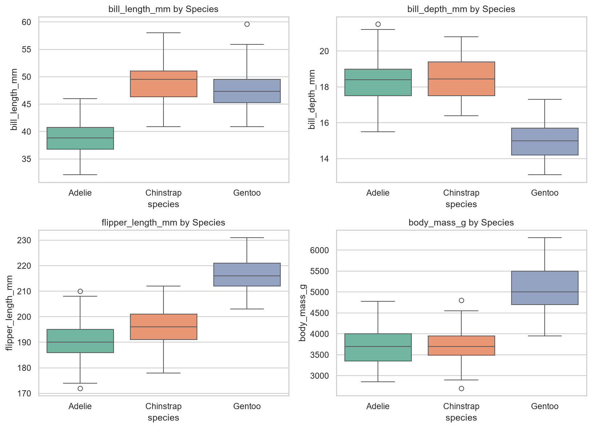
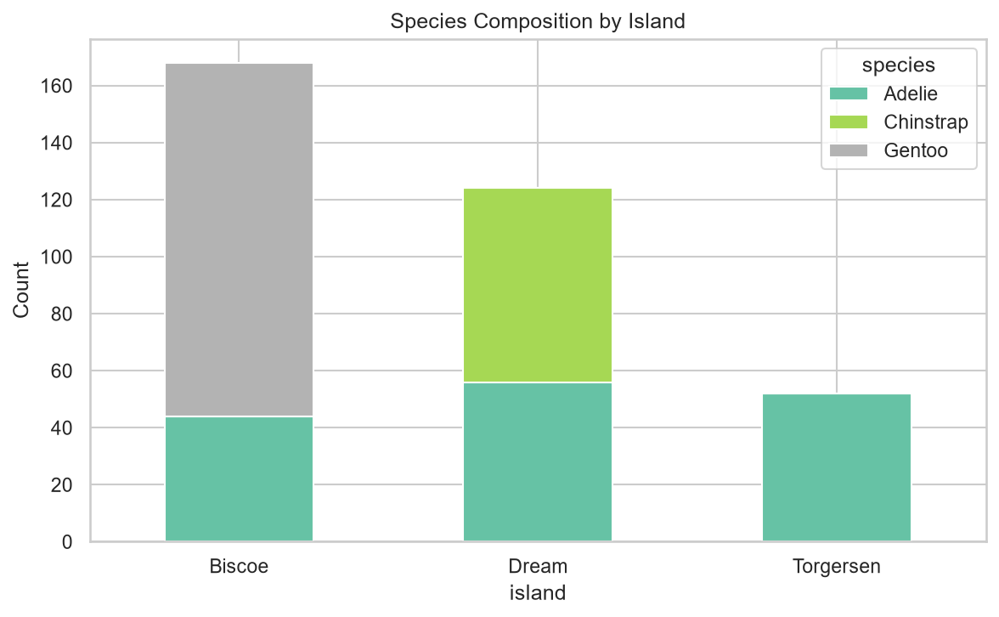
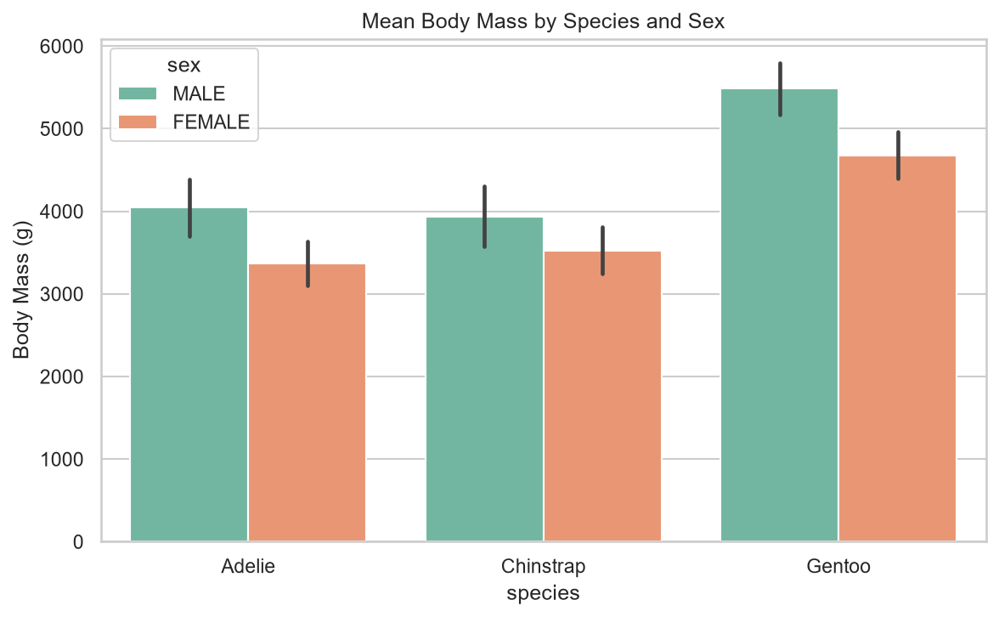
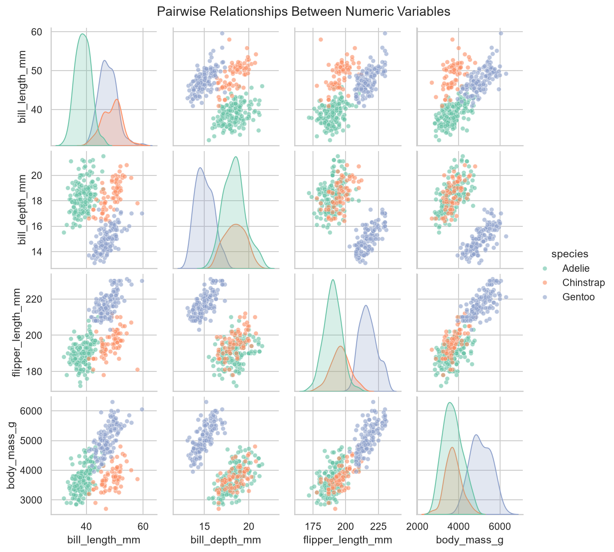

<!DOCTYPE html>
<html lang="en">
<head>
    <meta charset="UTF-8">
    <meta name="viewport" content="width=device-width, initial-scale=1.0">
    <title>Palmer Penguins Descriptive Analysis</title>
    
    </head>
    <body>
    

        <header>
            <h1>🐧 Palmer Penguins Descriptive Analysis</h1>
            
Comprehensive Exploratory Data Analysis using Python

        </header>

        <strong>Repository:</strong> <a href="https://github.com/MalakaSupun/Penguins-EDA-Wizard">Penguins-EDA-Wizard</a> 
        <strong>Dataset:</strong> Palmer Penguins (344 observations, 7 variables) 
        <strong>Tools:</strong> Python (pandas, seaborn, matplotlib, scipy)
    

<!-- INTRODUCTION -->
<h2>📋 1. Introduction</h2>
    

        
This report presents a descriptive analysis of the Palmer Penguins dataset, which records physical measurements for 344 penguins across three species (Adelie, Chinstrap, and Gentoo) sampled from three islands in the Palmer Archipelago, Antarctica.

    

    

The dataset contains four numeric variables — bill length, bill depth, flipper length, and body mass — and three categorical variables: species, island, and sex.

<strong>Goals of this analysis:</strong>

<ol>
    <li>Compute descriptive statistics for each variable</li>
    <li>Visualize the distribution and behavior of each variable</li>
    <li>Examine how numeric variables differ across categories (species, island, sex)</li>
    <li>Draw conclusions from observed patterns and relationships</li>
</ol>

<!-- DATASET OVERVIEW -->
<h2>🔍 2. Dataset Overview</h2>

<h3>Variables</h3>
<ul>
    <li><strong>Categorical Variables:</strong>
        <ul>
            <li><code>species</code> — Adelie, Chinstrap, Gentoo</li>
            <li><code>island</code> — Biscoe, Dream, Torgersen</li>
            <li><code>sex</code> — Male, Female (11 missing values)</li>
        </ul>
    </li>
    <li><strong>Numeric Variables:</strong>
        <ul>
            <li><code>bill_length_mm</code></li>
            <li><code>bill_depth_mm</code></li>
            <li><code>flipper_length_mm</code></li>
            <li><code>body_mass_g</code></li>
        </ul>
    </li>
</ul>

    <strong>Data Quality Note:</strong> Two rows were missing all four numeric measurements and were excluded from the numeric analysis, leaving 342 usable records. All categorical variables retain their full counts where relevant.

<!-- DESCRIPTIVE STATISTICS - NUMERIC -->
<h2>📊 3. Descriptive Statistics — Numeric Variables</h2>

All four numeric variables have skewness close to zero (between -0.14 and 0.47), indicating roughly symmetric distributions with a slight right-skew for body mass. Negative kurtosis values (around -0.7 to -1.0) indicate flatter-than-normal distributions — consistent with three distinct species creating multiple humps rather than one sharp peak.

<table>
    <thead>
        <tr>
            <th>Variable</th>
            <th>N</th>
            <th>Mean</th>
            <th>Median</th>
            <th>Std Dev</th>
            <th>Min</th>
            <th>Max</th>
            <th>Skew</th>
        </tr>
    </thead>
    <tbody>
        <tr>
            <td>Bill length (mm)</td>
            <td>342</td>
            <td>43.92</td>
            <td>44.45</td>
            <td>5.46</td>
            <td>32.1</td>
            <td>59.6</td>
            <td>0.05</td>
        </tr>
        <tr>
            <td>Bill depth (mm)</td>
            <td>342</td>
            <td>17.15</td>
            <td>17.30</td>
            <td>1.97</td>
            <td>13.1</td>
            <td>21.5</td>
            <td>-0.14</td>
        </tr>
        <tr>
            <td>Flipper length (mm)</td>
            <td>342</td>
            <td>200.92</td>
            <td>197.00</td>
            <td>14.06</td>
            <td>172.0</td>
            <td>231.0</td>
            <td>0.35</td>
        </tr>
        <tr>
            <td>Body mass (g)</td>
            <td>342</td>
            <td>4201.75</td>
            <td>4050.00</td>
            <td>801.95</td>
            <td>2700</td>
            <td>6300</td>
            <td>0.47</td>
        </tr>
    </tbody>
</table>

<!-- DESCRIPTIVE STATISTICS - CATEGORICAL -->
<h2>🎯 4. Descriptive Statistics — Categorical Variables</h2>

    
    
<strong>Figure 1:</strong> Distribution of observations by species, island, and sex

<table>
    <thead>
        <tr>
            <th>Species</th>
            <th>Count</th>
            <th>Percent</th>
        </tr>
    </thead>
    <tbody>
        <tr>
            <td>Adelie</td>
            <td>152</td>
            <td>44.2%</td>
        </tr>
        <tr>
            <td>Gentoo</td>
            <td>124</td>
            <td>36.0%</td>
        </tr>
        <tr>
            <td>Chinstrap</td>
            <td>68</td>
            <td>19.8%</td>
        </tr>
    </tbody>
</table>

<table>
    <thead>
        <tr>
            <th>Island</th>
            <th>Count</th>
            <th>Percent</th>
        </tr>
    </thead>
    <tbody>
        <tr>
            <td>Biscoe</td>
            <td>168</td>
            <td>48.8%</td>
        </tr>
        <tr>
            <td>Dream</td>
            <td>124</td>
            <td>36.0%</td>
        </tr>
        <tr>
            <td>Torgersen</td>
            <td>52</td>
            <td>15.1%</td>
        </tr>
    </tbody>
</table>

<table>
    <thead>
        <tr>
            <th>Sex</th>
            <th>Count</th>
            <th>Percent</th>
        </tr>
    </thead>
    <tbody>
        <tr>
            <td>Male</td>
            <td>168</td>
            <td>50.5%</td>
        </tr>
        <tr>
            <td>Female</td>
            <td>165</td>
            <td>49.5%</td>
        </tr>
    </tbody>
</table>

<strong>Key Findings:</strong> Adelie is the most common species (44.2%), and Biscoe is the most-sampled island (48.8%). Sex is almost perfectly balanced (50.5% male vs. 49.5% female).

<!-- DISTRIBUTION OF NUMERIC VARIABLES -->
<h2>📈 5. Distribution of Numeric Variables</h2>

    
    
<strong>Figure 2:</strong> Histograms of the four numeric variables, colored by species

Each histogram reveals that the apparent single distribution is actually a mixture of three species-specific sub-distributions. <strong>Bill depth</strong> and <strong>body mass</strong> show the clearest separation, with Gentoo penguins standing apart from Adelie and Chinstrap.

    
    
<strong>Figure 3:</strong> Correlation matrix of the numeric variables

    <strong>Correlation Insights:</strong>
    <ul>
        <li><strong>Flipper length & Body mass:</strong> Strong positive correlation (r ≈ 0.87) — as expected for overall body size</li>
        <li><strong>Bill depth vs. other variables:</strong> Negatively correlated with flipper length (r ≈ -0.58) and body mass (r ≈ -0.47) — a between-species effect</li>
        <li><strong>Species Effect:</strong> Gentoo penguins have long flippers, high body mass, and shallow bills, while Adelie/Chinstrap show the opposite pattern</li>
    </ul>

<!-- BEHAVIOR BY CATEGORY -->
<h2>🎲 6. Behavior of Variables by Category</h2>

<!-- By Species -->
<h3>6.1 By Species</h3>
    

    
    
<strong>Figure 4:</strong> Boxplots of each numeric variable by species

<strong>Species is the dominant source of variation</strong> in this dataset:

<ul>
    <li><strong>Gentoo penguins</strong> are markedly larger (body mass, flipper length) but have notably shallower bills than the other two species</li>
    <li><strong>Adelie</strong> has the shortest bill length</li>
    <li><strong>Chinstrap</strong> and Gentoo have similar bill lengths but very different bill depths and body sizes</li>
</ul>

<table>
    <thead>
        <tr>
            <th>Species</th>
            <th>Mean Bill Length (mm)</th>
            <th>Mean Bill Depth (mm)</th>
            <th>Mean Flipper Length (mm)</th>
            <th>Mean Body Mass (g)</th>
        </tr>
    </thead>
    <tbody>
        <tr>
            <td>Adelie</td>
            <td>38.79</td>
            <td>18.35</td>
            <td>189.95</td>
            <td>3700.66</td>
        </tr>
        <tr>
            <td>Chinstrap</td>
            <td>48.83</td>
            <td>18.42</td>
            <td>195.82</td>
            <td>3733.09</td>
        </tr>
        <tr>
            <td>Gentoo</td>
            <td>47.50</td>
            <td>14.98</td>
            <td>217.19</td>
            <td>5076.02</td>
        </tr>
    </tbody>
</table>

<strong>Statistical Significance:</strong> One-way ANOVA confirms these differences are statistically significant for:

<ul>
    <li>Body mass (F = 343.6, p &lt; 0.001)</li>
    <li>Bill length (F = 410.6, p &lt; 0.001)</li>
</ul>

<!-- By Island -->
<h3>6.2 By Island</h3>

    
    
<strong>Figure 5:</strong> Species composition by island

    <strong>Island Confounding:</strong> Island is <strong>not</strong> an independent grouping factor — it is almost a proxy for species:
    <ul>
        <li>Torgersen contains <strong>only</strong> Adelie penguins</li>
        <li>Dream contains Adelie and Chinstrap</li>
        <li>Biscoe contains Adelie and Gentoo</li>
    </ul>
    
As a result, apparent differences in measurements 'by island' (e.g., higher average body mass on Biscoe) are largely driven by which species happen to live there, rather than an island effect in itself.

<!-- By Sex -->
<h3>6.3 By Sex</h3>
    

    
    
<strong>Figure 6:</strong> Mean body mass by species and sex, with standard deviation error bars

Within every species, <strong>males are consistently heavier than females</strong> — a pattern known as <strong>sexual size dimorphism</strong>. The gap is present across all three species, meaning sex and species act as independent, additive sources of variation in body mass rather than one masking the other.

<!-- Pairwise Relationships -->
<h3>6.4 Pairwise Relationships</h3>

    
    
<strong>Figure 7:</strong> Pairwise scatterplots and marginal distributions for all numeric variables, colored by species

The pairplot shows that combinations of just two variables (e.g., bill length and bill depth, or flipper length and bill depth) are enough to separate the three species almost perfectly into distinct clusters. This suggests the four numeric measurements together carry strong discriminative information about species identity.

<!-- CONCLUSIONS -->
<h2>✅ 7. Conclusions</h2>

<ol>
<li><strong>Species Dominance:</strong> Species is the primary driver of variation in all four numeric variables. Gentoo penguins are distinctly larger with shallower bills; Adelie has the shortest bills; Chinstrap sits between Adelie and Gentoo on most measures but overlaps closely with Gentoo on bill length.</li>
    
<li><strong>Island Confounding:</strong> Island differences are confounded with species — each island hosts a different subset of species, so island-level averages mainly reflect species composition rather than a geographic effect.</li>
    
<li><strong>Sexual Dimorphism:</strong> Sex creates a consistent, additive effect: males are heavier than females within every species, indicating sexual dimorphism independent of species differences.</li>

<li><strong>Bivariate Relationships:</strong> Flipper length and body mass are strongly correlated (larger-bodied birds have longer flippers), while bill depth behaves almost inversely to overall body size across species — driven by Gentoo's unusually shallow bill relative to its large body.</li>

<li><strong>Distribution Properties:</strong> All four numeric variables are reasonably symmetric (low skew) but flatter than a normal distribution (negative kurtosis), which is explained by the underlying three-species mixture rather than any single well-behaved population distribution.</li>

<li><strong>Practical Implication:</strong> Species can be predicted with high accuracy from just two of the four numeric measurements (e.g., bill length and bill depth), as shown in the pairplot clustering — a useful basis for a simple classification exercise as a follow-up to this descriptive analysis.</li>
</ol>

<!-- FOOTER -->

    <strong>Analysis Date:</strong> 2026 
    <strong>Repository:</strong> <a href="https://github.com/MalakaSupun/Penguins-EDA-Wizard">Penguins-EDA-Wizard</a> 
    <strong>Tools:</strong> Python • pandas • seaborn • matplotlib • scipy

</body>
</html>
